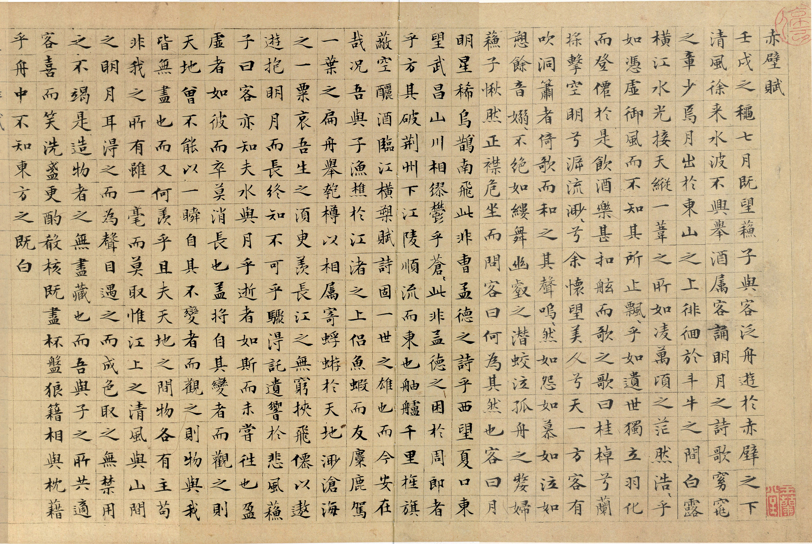
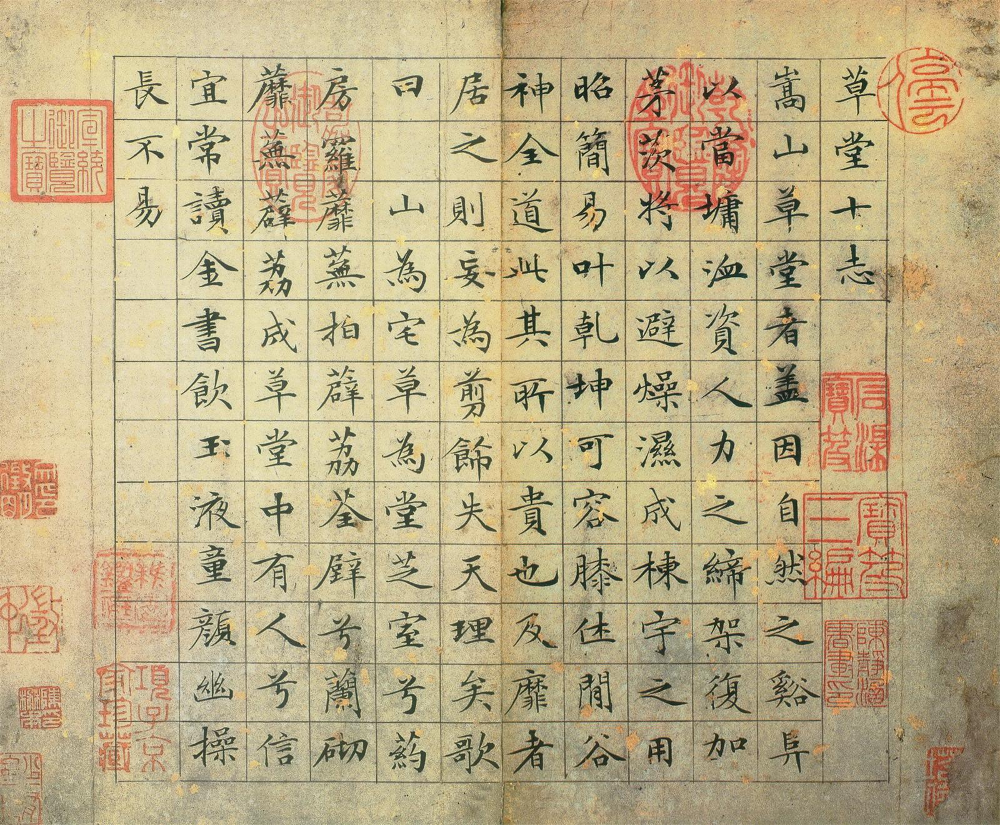

# imgs

> 本仓库保存《书法练习轨迹--明月几时有》相关图片。

## 仓库

- **gitee**  [imgs]( https://gitee.com/xy180/imgs ) &ensp; [calligraphy]( https://gitee.com/xy180/calligraphy ) &ensp; [书法练习轨迹--明月几时有.html]( http://xy180.gitee.io/imgs/preview/%E4%B9%A6%E6%B3%95%E7%BB%83%E4%B9%A0%E8%BD%A8%E8%BF%B9--%E6%98%8E%E6%9C%88%E5%87%A0%E6%97%B6%E6%9C%89.html )

- **github** [imgs]( https://github.com/scott180/imgs ) &ensp; [calligraphy]( https://github.com/scott180/calligraphy ) &ensp; [书法练习轨迹--明月几时有]( https://scott180.github.io/pages/%E4%B9%A6%E6%B3%95%E7%BB%83%E4%B9%A0%E8%BD%A8%E8%BF%B9--%E6%98%8E%E6%9C%88%E5%87%A0%E6%97%B6%E6%9C%89 ) 

- **gitlab**  [imgs]( https://gitlab.com/xuyq123/imgs ) &ensp; [calligraphy]( https://gitlab.com/xuyq123/calligraphy )

- **csdn_code** [imgs]( https://codechina.csdn.net/xu180/imgs ) &ensp; [calligraphy]( https://codechina.csdn.net/xu180/calligraphy )

---

## 图片 

> 赤壁赋

> 草堂十志

---

- gitee 

> 练习2021040202 

---

- github

> 练习2021042501 

---

- csdn_code

> 练习2021042504 

---

- gitlab

> 练习2021050202 

